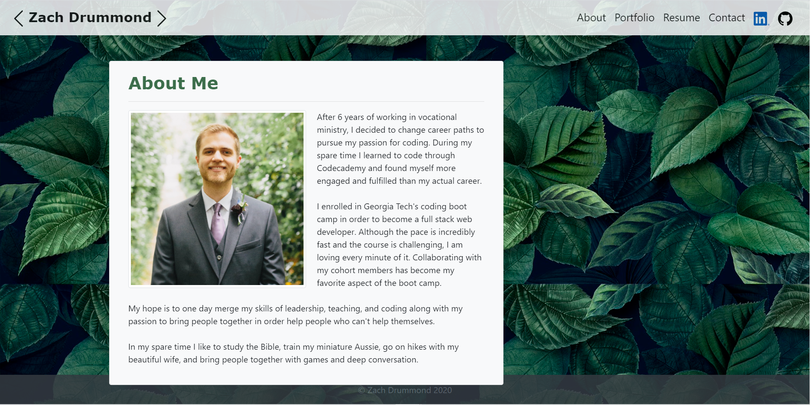
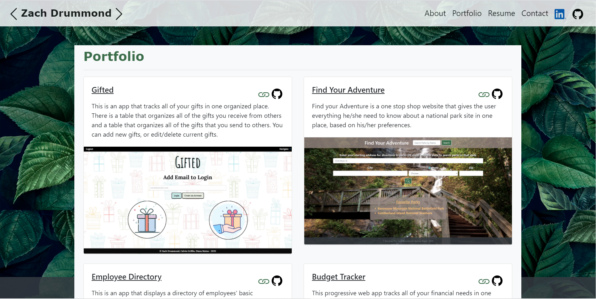
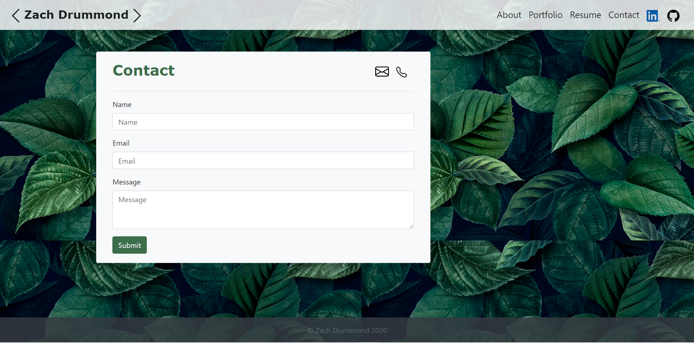

# My Responsive Portfolio - React.js

## Table of Contents
* [Description](#Description)
* [Links](#Links)
* [Design Elements](#Design-Elements)
* [Pages Preview](#Pages-Preview)
* [Credits](#Credits)

## Description
This is my responsive portfolio that includes all of my best applications, a personal profile, a place to contact me, and links to my resume, email, and LinkedIn and GitHub accounts.

## Links
* Website: https://zachdrummond.github.io/portfolio-react/
* GitHub Repository: https://github.com/zachdrummond/portfolio-react

## Design Elements
* JavaScript
* React.js
* Bootstrap
* CSS

### Updates
* New Design - React.js
* Added Portfolio Projects

## Pages Preview
### *About*

### *Portfolio*

### *Contact*

## Credits
* https://reactjs.org/
* https://reactrouter.com/web/guides/quick-start
* Bootstrap: https://getbootstrap.com/